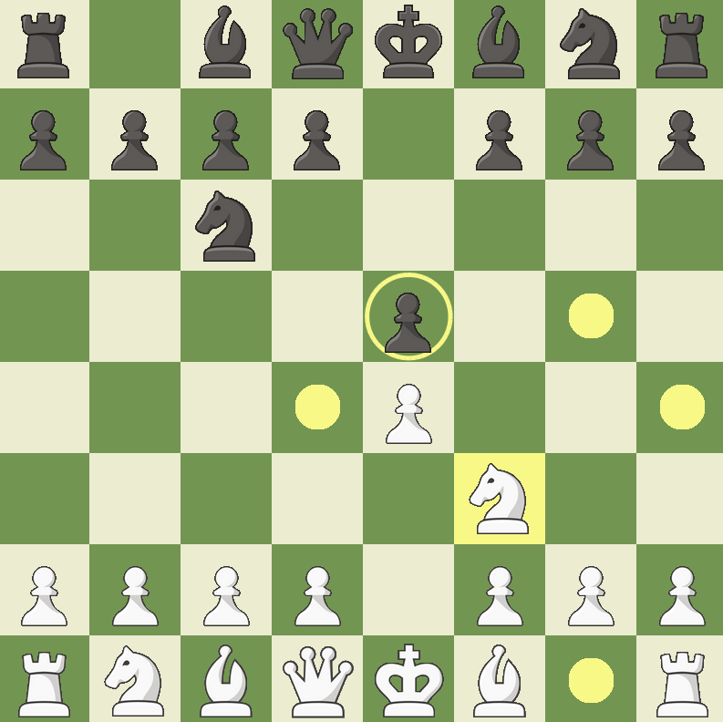

# Very simple chess game.
Written in Java using the libgdx game development library.



# Features:
- [x] Legal/illegal move detection
- [x] Win detection

## Run with:
**Important: You need to use Java 17**
```
./gradlew desktop:run
```
